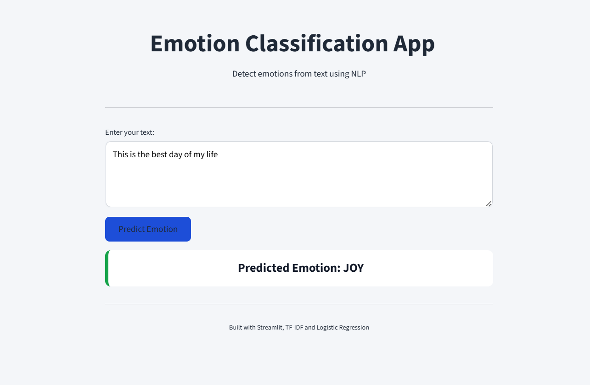
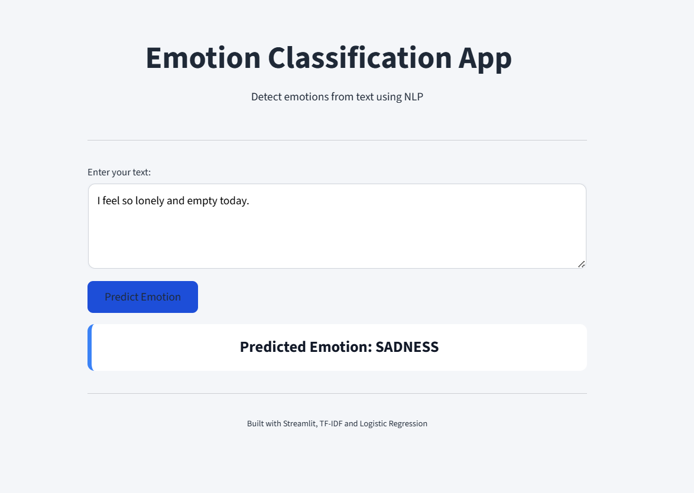
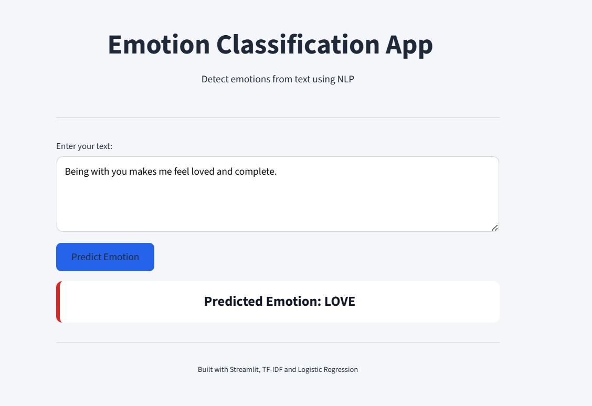
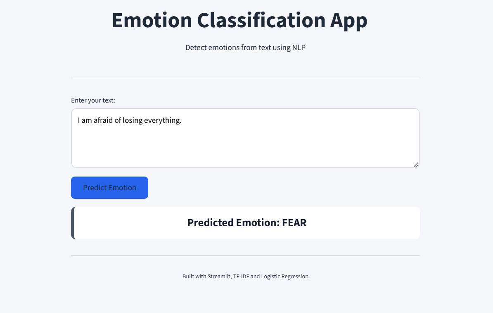
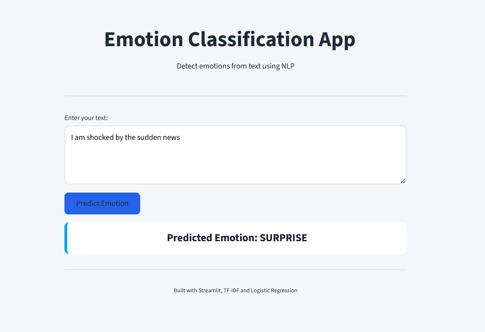

# 🎭 Emotion Classification App  
### *Understand emotions hidden in text using NLP & Machine Learning*

---

## ✨ About the Project

The **Emotion Classification App** is an end-to-end **Natural Language Processing (NLP)** project that detects **human emotions from text**.

It uses **TF-IDF feature extraction** and a **Logistic Regression model**, wrapped inside a clean and interactive **Streamlit web application**.

📌 Perfect for:
- NLP beginners
- ML portfolio projects
- Resume & LinkedIn showcase

---

## 🎯 What Can This App Do?

✔ Detect emotions in real-time  
✔ Clean and professional UI  
✔ Fast & lightweight ML model  
✔ Easy to deploy and extend  

---

## 🧠 Emotions the Model Understands

| Emotion | Emoji |
|------|------|
| Joy | 😊 |
| Sadness | 😢 |
| Fear | 😨 |
| Anger | 😡 |
| Love | ❤️ |
| Surprise | 😲 |

---
## 🛠️ Tech Stack Used

| Category | Tools |
|-------|------|
| Language | Python |
| NLP | TF-IDF Vectorizer |
| ML Model | Logistic Regression |
| Web Framework | Streamlit |
| Libraries | scikit-learn, pandas, numpy |

---

---

## 🖼️ App Screenshots

### 😊 Joy Prediction

### 😢 Sadness Prediction

### ❤️ Love Prediction

### 😨 Fear Prediction

### 😲 Surprise Prediction

---

